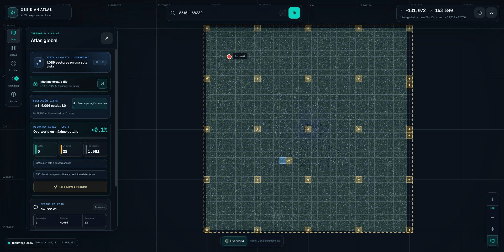
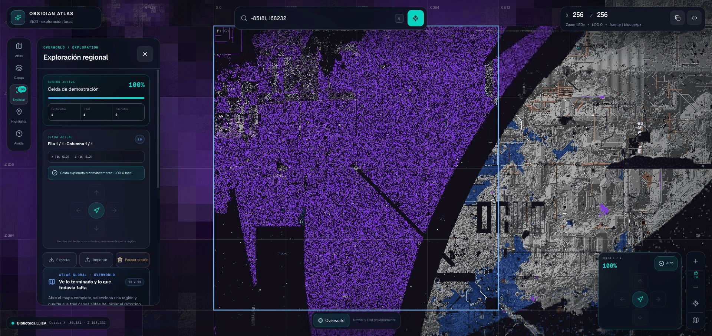
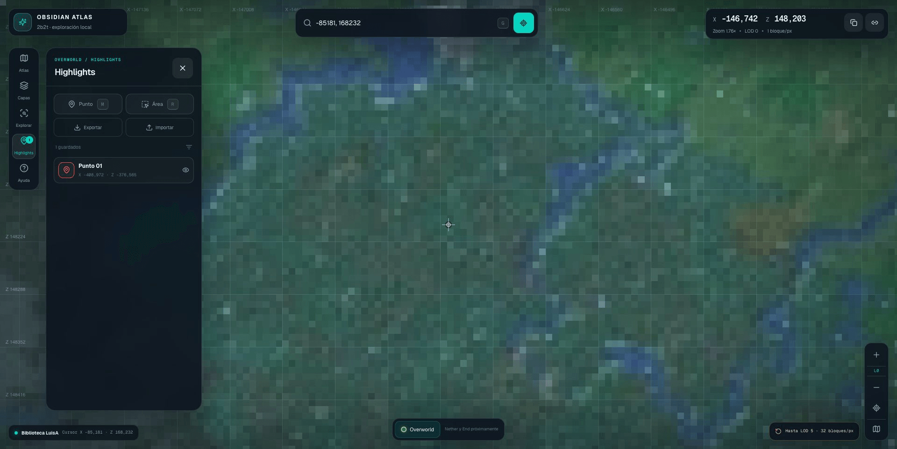

<p align="center">
  
</p>

# Obsidian Atlas

Obsidian Atlas es una herramienta local para revisar el Overworld publicado por
[2b2t.place](https://2b2t.place) por regiones pequeñas y a un ritmo decidido
por el usuario. El mapa se divide en una rejilla de tiles; toda región nueva se
explora con los datos originales LOD 0, permite avanzar en las cuatro
direcciones y registra qué celdas ya fueron revisadas. El zoom y el
desplazamiento cambian únicamente la presentación: no reducen el nivel de
detalle de la sesión.

La aplicación web de escritorio se sirve únicamente en `localhost`. Los datos
persistentes se guardan de forma atómica en LuisA como una única sesión
canónica. El navegador conserva solamente una WAL temporal mientras se confirma
una escritura; nunca crea otra versión autoritativa. La biblioteca primaria
conserva únicamente el panorama Overworld LOD 10 necesario para la vista
completamente alejada. Todo detalle se escribe, solo después de una decisión
del usuario, en una biblioteca regional APFS separada y respaldada por LuisA.
Antes de explorar, comprueba la región exacta contra SQLite y el filesystem; si
falta algo, descarga únicamente lo pendiente y reutiliza tanto los WebP válidos
como los `404` ya confirmados.

La versión actual admite únicamente **Overworld**.

## Qué incluye

- visor canvas con coordenadas X/Z, zoom, LOD y bloques por píxel;
- Atlas global con los 1,089 sectores visibles en una sola vista;
- una sola vista de descarga local LOD 0, con sectores listos, en curso y por
  explorar;
- rejilla maestra 33×33 basada en la huella irregular real de 66,464 tiles LOD 3;
- selección por arrastre de uno o varios sectores de 32,768×32,768 bloques;
- descarga completa obligatoria de una región antes de abrir su sesión LOD 0;
- regiones dibujadas, tomadas de la vista o introducidas por coordenadas como
  alternativa avanzada;
- una celda de 512×512 bloques por tile LOD 0;
- navegación cardinal con cruceta y flechas del teclado;
- zoom y desplazamiento visuales sin cambiar el LOD de datos;
- lupa circular de detalle activada con `L` durante la exploración;
- zoom acotado a un presupuesto seguro de tiles visibles y cámara contenida en
  la región;
- una única sesión de exploración, persistente, pausable y exportable;
- conteo automático al visitar una celda; la celda actual nueva permanece sin
  relleno y muestra su marca al abandonarla o al volver a ella;
- ausencias `404` persistentes y omitidas automáticamente, separadas de las
  celdas revisadas;
- descarga regional reanudable y adaptativa entre `0.25` y `16 req/s`;
- capas `base`, `overlay` y `newchunks`;
- puntos y áreas con nombre, color y notas privadas;
- ruta etiquetada entre highlights con origen automático o elegido y exportación
  JSON/PNG;
- lectura exclusiva de la biblioteca local;
- tarjeta de espacio disponible en LuisA, sin metas ni trabajos globales;
- composición opcional de una región como PNG o WebP desde el CLI.

## Inicio rápido en LuisA

Requisitos:

- macOS con `/Volumes/LuisA` montado;
- el sparsebundle APFS de LuisA en
  `/Volumes/LuisA/2b2t_map/2b2t_tiles.sparsebundle`; el lanzador lo monta en
  `/Volumes/2b2t Tiles`;
- Python 3.10 o posterior;
- Node.js `>=22.13.0`;
- Google Chrome de escritorio actualizado, con viewport mínimo de 960 px;
- `screen`, `npm` y `/usr/bin/lockf`.

Instala las dependencias una vez:

```bash
python3 -m venv .venv
source .venv/bin/activate
python -m pip install --upgrade pip
python -m pip install -r requirements.txt

cd viewer
npm ci
cd ..
```

Instala también el icono nativo una vez:

```bash
./install_macos_app.sh
```

Esto crea **Obsidian Atlas.app** en `/Applications`. Al abrirla desde
Aplicaciones, el lanzador inicia el servidor supervisado si está apagado,
espera a que quede listo y abre [http://localhost:3001](http://localhost:3001)
en Google Chrome. Si Atlas ya está activo, reutiliza la misma instancia. La app
no se ejecuta al iniciar sesión ni copia el código: cada arranque usa directamente
los archivos fuente actuales de este repositorio. En el primer arranque macOS
solicita permiso para acceder al proyecto dentro de `Documents`; hay que elegir
**Permitir** una sola vez. Los mapas, el workspace y los backups siguen en
LuisA. Solo vuelve a ejecutar el instalador si mueves el proyecto o cambias Node
o Python.

Inicia el atlas:

```bash
./start_local_atlas_luisa.sh
```

Abre [http://localhost:3001](http://localhost:3001). El lanzador mantiene una
sola sesión local en segundo plano y valida que la biblioteca, LuisA, Python y
el visor estén disponibles. Montar la biblioteca es parte del arranque; los
modos `--status` y `--stop` no montan ni desmontan volúmenes.

Para abrir directamente una zona por coordenadas X/Z y conservar un zoom
inicial explícito:

```bash
open 'http://localhost:3001/#@-85181,168232,1.0000,0'
```

```bash
./start_local_atlas_luisa.sh --status
./start_local_atlas_luisa.sh --stop
```

El log local está en:

```text
/Users/luisalvarado/Library/Application Support/ObsidianAtlas/local_atlas.log
```

Se puede cambiar el puerto o el intérprete al iniciar:

```bash
OBSIDIAN_ATLAS_VIEWER_PORT=3100 \
PYTHON_BIN='/Users/luisalvarado/Documents/GitHub/2b2t_map/.venv/bin/python' \
  ./start_local_atlas_luisa.sh
```

## Flujo de exploración

1. Abre **Atlas** desde el dock o con `0` / `Home`.
2. Consulta la descarga local LOD 0 y filtra sectores **Listos**, **En curso**
   o **Por explorar**.
3. Haz clic en un sector o arrastra sobre varios. El panel muestra sus límites
   X/Z y la cantidad de filas y columnas LOD 0.
   Desde el inspector también puedes marcar un sector como **explorado en
   Minecraft**; el Atlas lo conserva con un overlay azul y una marca `✓`.
4. El visor comprueba las tres capas. Si falta algo, elige el ritmo y pulsa
   **Descargar región completa**. La exploración permanece bloqueada.
5. Puedes detener el trabajo sin perder datos y usar **Reanudar descarga**
   después. El progreso exacto incluye WebP guardados, `404`, pendientes,
   faltantes y fallos.
6. Cuando la región alcance 100%, pulsa **Explorar región**. La primera celda
   se cuenta como visitada, pero se abre a 512×512 bloques sin relleno mientras
   siga siendo la celda actual.
7. Recorre la región con la cruceta norte/sur/este/oeste, las flechas del
   teclado o un clic. La celda nueva se cuenta al entrar; al salir, la anterior
   muestra su relleno de revisada. Si vuelves a ella conserva su marca. Un
   `404` se omite automáticamente.
8. Acerca, aleja o arrastra el mapa cuando necesites inspeccionar una
   estructura: los datos continúan en LOD 0 y el zoom manual se conserva
   exactamente al moverte a otra celda. Presiona `L` para activar una lupa
   circular de aumento 5× que sigue el puntero y se mantiene dentro de la
   ventana al acercarse a un borde.
9. **Pausar sesión** la conserva en LuisA; después puedes abrirla desde
   **Guardado local · LuisA**. **Guardar ahora** fuerza una escritura inmediata.

La descarga y la revisión siguen siendo conceptos distintos. La primera ocurre
por región y debe terminar antes de entrar; la segunda se registra
automáticamente al visitar una celda, aunque el relleno de la celda actual se
retrase para no tapar el mapa. Una ausencia `404` no se disfraza de revisión:
se guarda en su propio bitset y se excluye del total revisable.
La marca azul también es independiente: representa únicamente que terminaste
ese sector en el juego real y puede activarse o quitarse manualmente.

### Recorrido visual

**1. Atlas global.** Muestra los 1,089 sectores del Overworld, el progreso LOD
0 y los límites X/Z exactos de la selección.



**2. Exploración regional.** La cabecera conserva coordenadas, zoom, LOD y
bloques por píxel; la tarjeta lateral muestra la celda actual y su rango.



**3. Highlights.** Permite marcar puntos o áreas, encontrarlos por nombre,
ocultarlos, calcular un recorrido etiquetado entre todos los de la región y
exportar tanto sus datos como la vista actual.



### Qué es un tile

Un **tile** es una pieza cuadrada del mapa, como una baldosa. En el máximo
detalle cada archivo WebP mide 512×512 píxeles y representa 512×512 bloques de
Minecraft. Las coordenadas X/Z indican dónde encaja esa pieza; al alejarte, los
LOD superiores resumen áreas cada vez mayores. El visor une automáticamente
las piezas visibles, por eso puedes desplazarte como si fuera una sola imagen
sin cargar el mapa completo en memoria.

No necesitas pausar manualmente para cambiar de zona: la sesión canónica actual
permanece intacta mientras la selección nueva pasa por la comprobación o
descarga obligatoria. Solo cuando la región queda completa reemplaza
atómicamente a la sesión anterior.

El Atlas se puede abrir mientras una sesión está activa. La cámara y el zoom
regionales se conservan y se restauran al volver. Un clic selecciona el sector
y la cruceta permite corregir el foco desde escritorio. El inspector ofrece
anterior/siguiente y límites X/Z exactos. La vista global consulta los
catálogos locales en modo lectura y usa internamente la huella irregular
publicada para calcular el objetivo LOD 0. Los `404` confirmados se excluyen,
de modo que una descarga exhaustiva pueda alcanzar 100% sin presentar tiles
inexistentes como pendientes eternos.

## Rejilla LOD 0 y coordenadas

Los límites de una región son rangos semiabiertos:

```text
X [minX, maxX) × Z [minZ, maxZ)
```

La región se expande a los bordes de los tiles que toca. Las coordenadas
negativas se resuelven con piso matemático, por lo que `X=-1` pertenece al tile
`-1`, no al tile `0`.

```text
LOD de datos de toda región nueva = 0
celda = 512 × 512 bloques
```

En el detalle, rueda, pellizco, doble clic, `+`, `-` y arrastre mantienen LOD 0
y una escala mínima de seguridad de 8×6 tiles antes del margen de render. El
botón **Encuadrar región activa** abre un panorama temporal en LOD 10 para
mostrar en una sola vista los límites, la ruta inteligente y todos los
highlights; al volver a una celda se restaura LOD 0. La cámara no puede perder
la región seleccionada. El modelo admite hasta 1,048,576 celdas por sesión y
avisa antes de iniciar una selección que supere ese límite.

Las sesiones creadas por versiones anteriores pueden importarse conservando su
LOD, escala, celda actual y progreso. Antes de reemplazar la sesión canónica por
una importada en LOD 0, el visor vuelve a verificar su región completa. Las
sesiones con LOD
heredado son de solo lectura; **Crear versión en LOD 0** lleva la copia nueva al
mismo paso obligatorio de descarga y solo entonces reemplaza la anterior.

## Capacidad de LuisA

El lanzador usa estas ubicaciones:

```text
Biblioteca preferida: /Volumes/2b2t Tiles/2b2t_tiles
Predescargas regionales: /Volumes/2b2t Tiles/ObsidianAtlasRegions/2b2t_tiles
Respaldo físico: /Volumes/LuisA
```

La tarjeta **Espacio para regiones · LuisA** consulta en tiempo real el espacio
de la biblioteca regional y su respaldo. No calcula el costo de descargar todo
el Overworld, no interpreta reportes globales antiguos y no inicia trabajos.
Cada región elegida realiza su propio preflight con 20% de margen antes de
descargar.

El resultado puede ser:

- capacidad verificada;
- margen insuficiente;
- runtime local no configurado.

Es un diagnóstico de almacenamiento. No crea trabajos ni recorre el mapa.

## Panorama local y política bajo demanda

El lanzador monta el sparsebundle APFS de LuisA, pero no inicia ni reanuda
`download_all_2b2t.py`. La biblioteca primaria contiene solo las tres capas
Overworld LOD 10 necesarias para orientar, encuadrar y seleccionar desde la
vista completamente alejada. No existe una meta porcentual mundial.

Los LOD 0–9 se obtienen exclusivamente mediante **Descargar región completa** y
se escriben en la biblioteca regional. Una selección terminada permanece en
LuisA y puede reabrirse en ejecuciones posteriores. Cambiar de región no crea
una descarga de fondo ni amplía automáticamente el alcance.

`download_all_2b2t.py` permanece en el repositorio como herramienta técnica de
diagnóstico y migración, pero no forma parte del flujo operativo del Atlas.

`reset_atlas_to_on_demand.py` reproduce de forma explícita la migración al modo
bajo demanda. Sin `--apply` solo muestra el inventario; con `--apply` exige las
rutas canónicas, rechaza descargas activas, respalda catálogo y hashes en LuisA,
conserva Overworld LOD 10 y vacía el detalle regional. No modifica el workspace.

## Descargar una región desde la interfaz

La UI ofrece cinco perfiles y empieza en **Máximo** para dedicar toda la
capacidad disponible a la región elegida:

```text
Mínimo 0.25 req/s · Suave 0.5 req/s · Normal 2 req/s · Rápido 8 req/s · Máximo 16 req/s
```

La descarga obligatoria incluye `base`, `overlay` y `newchunks` para todos los
tiles LOD 0 de los límites seleccionados. El runtime permite un trabajo
regional a la vez, calcula lo que realmente falta, valida espacio con margen y
publica resolución total, velocidad real de red, RPS logradas, setpoint,
transferencia y ETA del trabajo pendiente. Los perfiles rápidos arrancan a un
ritmo moderado y recuperan gradualmente hasta su objetivo. Un `429` o `403`
reduce el ritmo; `Retry-After` pausa globalmente a todos los workers.
**Detener descarga** termina el streaming activo, guarda el lote SQLite y
permite reanudar sin volver a pedir WebP válidos ni `404` conocidos.

El techo regional es 16 solicitudes por segundo y no se comparte con ningún
trabajo global. Los perfiles menores siguen disponibles si el usuario prefiere
reducir el ritmo. No usa Tor, proxies rotatorios ni cambios de IP para esquivar
protecciones; la velocidad se obtiene con conexiones persistentes, paralelismo
acotado y control adaptativo.

## CLI regional

`download_region_2b2t.py` ofrece el mismo trabajo acotado desde la terminal.
Usa coordenadas semiabiertas y reutiliza automáticamente los WebP válidos.

Ejemplo de una celda LOD 0 alrededor de `-85181, 168232`:

```bash
python download_region_2b2t.py \
  --x-min -85504 \
  --z-min 167936 \
  --x-max -84992 \
  --z-max 168448 \
  --dimension overworld \
  --lod 0 \
  --layers base,overlay,newchunks \
  --out '/Volumes/2b2t Tiles/ObsidianAtlasRegions/2b2t_tiles' \
  --workers 8 \
  --requests-per-second 16 \
  --max-tiles 3
```

También puede definirse una región desde su centro:

```bash
python download_region_2b2t.py \
  --center-x -85181 \
  --center-z 168232 \
  --width 2048 \
  --height 2048 \
  --dimension overworld \
  --lod 1 \
  --layers base,overlay \
  --out '/Volumes/2b2t Tiles/ObsidianAtlasRegions/2b2t_tiles' \
  --workers 2 \
  --requests-per-second 0.5
```

Para generar una imagen con coordenadas:

```bash
mkdir -p exports
python download_region_2b2t.py \
  --x-min -86016 \
  --z-min 167424 \
  --x-max -83968 \
  --z-max 169472 \
  --dimension overworld \
  --lod 0 \
  --layers base,overlay \
  --out '/Volumes/2b2t Tiles/ObsidianAtlasRegions/2b2t_tiles' \
  --workers 2 \
  --requests-per-second 1 \
  --compose exports/region.webp \
  --show-coordinates \
  --grid-step 128
```

Opciones importantes:

| Opción | Propósito |
| --- | --- |
| `--x-min`, `--z-min`, `--x-max`, `--z-max` | límites semiabiertos |
| `--center-x`, `--center-z`, `--width`, `--height` | modo alternativo por centro |
| `--lod 0..10` | resolución de los tiles |
| `--layers CSV` | capas solicitadas |
| `--workers 1..8` | transferencias simultáneas para ocultar latencia |
| `--requests-per-second 0.25..16` | techo global; comienza como máximo en 4 y se recupera gradualmente |
| `--max-tiles` | rechazo preventivo de inventarios inesperados |
| `--compose` | mosaico PNG o WebP |
| `--show-coordinates` | cuadrícula y etiquetas en el mosaico |

El directorio de salida posee un bloqueo regional. Los resultados se confirman
en lotes de hasta 32 tiles o un segundo, manteniendo `synchronous=FULL` y
forzando el commit final. `Ctrl+C` corta el streaming, cierra las conexiones y
conserva lo obtenido; repetir el mismo comando reutiliza los tiles válidos.
En una reanudación, un archivo cuyo tamaño y SHA-256 coinciden con el catálogo
validado evita una segunda decodificación WebP; cualquier diferencia se pone
en cuarentena y vuelve a descargarse.

Consulta todas las opciones con:

```bash
python download_region_2b2t.py --help
```

## Biblioteca local

Los tiles conservan la estructura pública:

```text
2b2t_tiles/
├── base/{lod}/overworld/{shard_x}/{shard_z}/t.{tile_x}.{tile_z}.webp
├── overlay/{lod}/overworld/{shard_x}/{shard_z}/t.{tile_x}.{tile_z}.webp
├── newchunks/{lod}/overworld/{shard_x}/{shard_z}/t.{tile_x}.{tile_z}.webp
├── tiles.sqlite3
└── download.log
```

Los shards agrupan 32 tiles y truncan hacia cero, igual que el cliente público.
La ubicación del tile en el mundo, en cambio, usa piso matemático. El visor y
el CLI aplican cada regla en su lugar correspondiente.

El visor consulta primero la biblioteca regional y después el panorama LOD 10.
Solo la capa continua `base` puede usar un ancestro como respaldo visual.
Una ausencia confirmada en `overlay` o `newchunks` significa transparencia:
nunca se amplía un píxel agregado sobre una celda detallada.
Chrome también puede abrir una carpeta `2b2t_tiles` con permiso de solo lectura
desde **Explorar → Biblioteca local**. `/api/tile` nunca obtiene imágenes
remotas: también ignora el parámetro heredado `online=1`. Solo el trabajo
regional explícito obtiene archivos de la fuente, y la sesión no se abre hasta
resolver toda el área.

## Workspace, sesiones y highlights

El runtime guarda el workspace autoritativo en una ruta fija derivada de
`OBSIDIAN_ATLAS_BACKING_ROOT`:

```text
/Volumes/LuisA/ObsidianAtlas/state/atlas-workspace.v1.json
```

Las escrituras usan revisión CAS, identificador idempotente, temporal en el
mismo directorio, `fsync`, renombrado atómico y backup. El documento conserva
exactamente cero o una sesión, hasta 10,000 highlights, la selección global y
los sectores marcados como explorados en Minecraft.
Una WAL fija en `localStorage` existe únicamente mientras una escritura está
pendiente; si su revisión base ya no coincide, LuisA gana automáticamente.
Nunca se crean ramas por pestaña. Si LuisA no está disponible o está en solo
lectura, la edición se bloquea para evitar otra fuente de verdad.

La primera migración desde un workspace multisesión une el progreso revisado de
regiones LOD equivalentes que se solapan, conserva la sesión con más trabajo y
guarda el documento completo anterior bajo:

```text
/Volumes/LuisA/ObsidianAtlas/backups/single-session-<fecha>-<uuid>/
```

La exportación manual de una sesión crea:

```text
obsidian-atlas-exploracion.json
```

El archivo contiene región, zoom, LOD, celda actual y bitsets independientes de
celdas revisadas y celdas sin datos. La importación valida versión, dimensión,
límites, contadores y codificación antes de reemplazar la sesión canónica.

Los highlights pueden ser puntos o áreas con nombre, nota, color y visibilidad.
Su exportación crea
`obsidian-atlas-highlights.json`.

El panel **Ruta inteligente** resuelve un TSP euclidiano abierto: para pocos
puntos usa Held–Karp exacto y para conjuntos grandes combina vecino más cercano
con mejora 2-opt. El inicio predeterminado es el highlight más cercano a
`minX/minZ`, pero puede buscarse y elegirse cualquier highlight como inicio.
El planificador corre en segundo plano y puede cancelarse sin bloquear el mapa. El mapa
superpone segmentos y etiquetas `A…Z`, `a…z`, `A1…`. **JSON** crea
`obsidian-atlas-ruta-highlights.json` con puntos, distancias y orden completo;
**PNG vista** captura el canvas visible con la ruta superpuesta. Desde la misma
tarjeta, **Renombrar y exportar a Xaero** guarda cada punto con su orden
(`A · Nombre`, `B · Nombre`…), limita el alcance a la región activa y abre la
vista previa antes de modificar los waypoints de Minecraft. Las áreas conservan
su título porque Xaero solo admite puntos. Los waypoints del Nether se exportan
ocultos por defecto para activarlos manualmente en Xaero cuando hagan falta.

## Variables locales

Para ejecutar `npm run dev` manualmente desde `viewer/`:

Si existe `../2b2t_tiles`, el modo de desarrollo la detecta automáticamente,
lee la biblioteca global desde allí y crea las predescargas en
`../2b2t_tiles_regions`. Las variables siguientes solo son necesarias para
elegir otras ubicaciones.

| Variable | Uso |
| --- | --- |
| `OBSIDIAN_ATLAS_TILE_ROOT` | raíz canónica `2b2t_tiles` |
| `OBSIDIAN_ATLAS_REGIONAL_TILE_ROOT` | raíz aislada y persistente para predescargas |
| `OBSIDIAN_ATLAS_BACKING_ROOT` | volumen físico usado en la comprobación |
| `OBSIDIAN_ATLAS_PYTHON` | intérprete para `download_region_2b2t.py` |
| `OBSIDIAN_ATLAS_OVERWORLD_REQUIREMENT_BYTES` | override explícito del preflight de capacidad |

Ejemplo:

```bash
cd viewer
OBSIDIAN_ATLAS_TILE_ROOT='/Volumes/2b2t Tiles/2b2t_tiles' \
OBSIDIAN_ATLAS_REGIONAL_TILE_ROOT='/Volumes/2b2t Tiles/ObsidianAtlasRegions/2b2t_tiles' \
OBSIDIAN_ATLAS_BACKING_ROOT='/Volumes/LuisA' \
OBSIDIAN_ATLAS_PYTHON='/Users/luisalvarado/Documents/GitHub/2b2t_map/.venv/bin/python' \
  npm run dev -- --hostname localhost --port 3001
```

El runtime acepta peticiones únicamente desde loopback, no recibe rutas ni
comandos desde el navegador y protege las mutaciones con un token efímero.

## Comprobaciones

```bash
python -m unittest discover -s tests

cd viewer
npm run lint
npm test
```

La documentación técnica del visor está en
[`viewer/README.md`](viewer/README.md).
