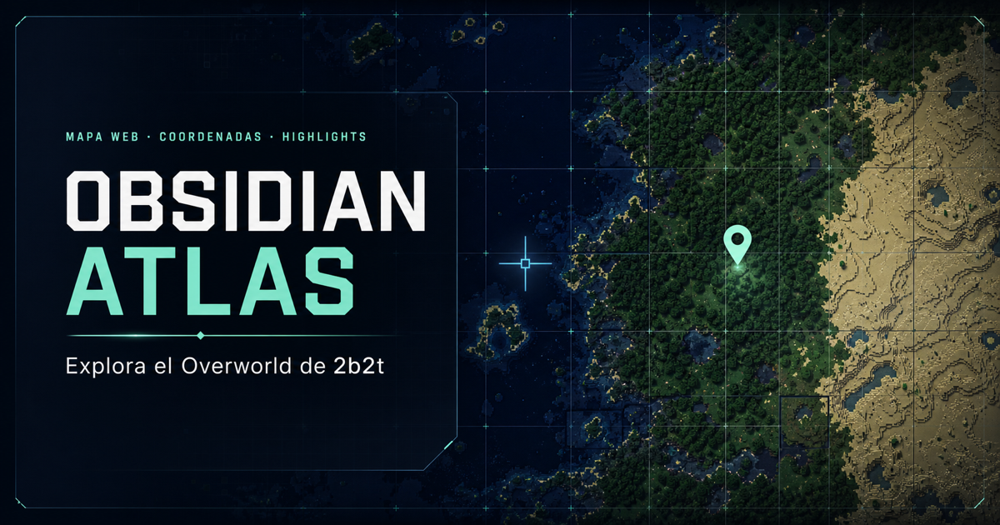

<p align="center">
  
</p>

# Obsidian Atlas y descargador offline de 2b2t.place

Este proyecto descarga directamente los tiles WebP públicos usados por
[2b2t.place](https://2b2t.place), conserva su estructura, registra el estado en
SQLite y permite verificar o componer zonas del mapa sin hacer capturas de
pantalla.

El flujo está dividido en cuatro programas:

- `download_all_2b2t.py`: descubre, estima y descarga de forma reanudable.
- `download_region_2b2t.py`: descarga una zona acotada y puede componerla en
  una sola imagen.
- `verify_download.py`: vuelve a validar los archivos registrados en SQLite.
- `compose_mosaic.py`: une tiles locales en una imagen PNG o WebP sin acceder a
  la red.

El prototipo que sirvió como base,
`/Users/luisalvarado/Downloads/descargar_mapa_2b2t.py`, se conservó sin
modificaciones. `download_all_2b2t.py` lo reemplaza para descargas completas y
seguras; la composición de regiones quedó separada en `compose_mosaic.py`.

## Obsidian Atlas: visor interactivo

`viewer/` contiene **Obsidian Atlas**, una interfaz HTML/canvas inspirada en la
claridad cartográfica de 2b2t.place, pero orientada a archivos locales,
coordenadas precisas y anotaciones privadas. El visor permite:

- navegar el Overworld arrastrando, con rueda, gestos o teclado;
- ver en todo momento X, Z, zoom, LOD y bloques por píxel;
- buscar coordenadas o el nombre de un highlight;
- combinar `base`, `overlay` y `newchunks`, con visibilidad y opacidad
  independientes;
- abrir directamente la carpeta local `2b2t_tiles` en Chrome;
- completar tiles locales ausentes mediante un respaldo online opcional;
- dibujar puntos y áreas, añadir nombre, notas y color, ocultarlos o
  eliminarlos;
- exportar e importar los highlights como JSON;
- copiar coordenadas o un enlace que conserva centro y zoom.

### Ejecutar el visor

Requiere Node.js `>=22.13.0`. Desde la raíz del repositorio:

```bash
cd viewer
npm ci
npm run dev
```

Abre en Chrome la dirección local que imprima el comando. `localhost` se
considera un contexto seguro y permite usar la File System Access API. Para
verificar una versión de producción:

```bash
cd viewer
npm run build
npm test
```

### Conectar los tiles locales en Chrome

1. Abre el panel **Archivo** de Obsidian Atlas.
2. Pulsa **Elegir carpeta local**.
3. Selecciona la carpeta `2b2t_tiles` misma, no la carpeta que la contiene.
4. Conserva **Respaldo online** activado si quieres pedir a 2b2t.place los
   tiles que aún no existen localmente; desactívalo para una sesión estrictamente
   local después de conectar el archivo.

Los tiles locales siempre tienen prioridad. El navegador obtiene permiso de
solo lectura y abre únicamente las rutas necesarias para el viewport; la
carpeta no se sube al servidor. Sin una carpeta conectada, el visor usa la
fuente online. Cuando el respaldo está activo, las solicitudes de tiles
ausentes sí salen a la red mediante `/api/tile`.

Chrome requiere volver a autorizar la carpeta cuando corresponda. Firefox y
Safari pueden navegar con la fuente online, pero actualmente no exponen el
selector de directorios compatible que usa el archivo local.

### Zoom, LOD, coordenadas y highlights

El LOD cambia automáticamente con el zoom entre 0 y 10. LOD 0 conserva la
resolución máxima de 1 bloque por píxel; cada incremento duplica los bloques
por píxel. La tarjeta superior muestra el centro X/Z, el zoom, el LOD y la
resolución. La barra inferior muestra las coordenadas del cursor, y la
cuadrícula adapta su separación al nivel de acercamiento.

La búsqueda acepta `X, Z`, `X Z`, `X, Z, zoom` o el nombre exacto de un
highlight. El enlace compartible usa un fragmento como
`#@-85181,168232,2.9423,0`; el fragmento conserva la vista, pero no publica los
highlights.

Atajos disponibles:

| Acción | Atajo |
| --- | --- |
| Mover el mapa | arrastrar o flechas |
| Cambiar zoom | rueda, doble clic, `+` o `-` |
| Ir a coordenadas/highlight | `G` |
| Abrir highlights | `H` |
| Marcar un punto | `M`, luego clic |
| Dibujar un área | `R`, luego arrastrar |
| Cancelar herramienta o cerrar panel | `Esc` |

Los highlights se guardan en `localStorage` del navegador actual. **Exportar**
descarga `obsidian-atlas-highlights.json`; **Importar** valida el archivo y
reemplaza la lista local por su contenido. Exporta una copia antes de limpiar
los datos del navegador, cambiar de perfil o importar otra lista.

El visor actual es deliberadamente **Overworld-only**. No abre Nether ni End,
aunque el descargador de Python pueda conocer esas dimensiones. Encontrarás la
guía completa del visor en [`viewer/README.md`](viewer/README.md).

## Requisitos e instalación del descargador

Se recomienda Python 3.10 o posterior. Las dependencias declaradas son:

- `requests>=2.31,<3`
- `Pillow>=10.0,<13`, con soporte para WebP

Instalación en un entorno virtual:

```bash
python3 -m venv .venv
source .venv/bin/activate
python -m pip install --upgrade pip
python -m pip install -r requirements.txt
```

Comprueba las interfaces instaladas:

```bash
python download_all_2b2t.py --help
python download_region_2b2t.py --help
python verify_download.py --help
python compose_mosaic.py --help
```

## Esquema público verificado

Antes de cada ejecución, el descargador consulta el JavaScript público de la
web y la documentación pública del proyecto. Si las señales esperadas cambian,
se detiene en vez de construir URLs supuestas. Los hashes y datos de esa
verificación se guardan en `discovery.json` y en la tabla `metadata`.

La URL directa de un tile es:

```text
https://2b2t.place/tiles/{layer}/{lod}/{dimension_id}/{shard_x}/{shard_z}/t.{tile_x}.{tile_z}.webp
```

Contrato comprobado:

| Propiedad | Valor |
| --- | --- |
| Dimensiones | `overworld=0`, `nether=1`, `end=2` |
| Capas | `base`, `overlay`, `newchunks` |
| LOD | `0` a `10`, ambos incluidos |
| Tamaño del tile | `512 × 512` píxeles |
| Bloques por píxel | `2**LOD` |
| Bloques por lado del tile | `512 * 2**LOD` |
| Eje X | aumenta hacia la derecha |
| Eje Z | aumenta hacia abajo |

LOD 0 es la máxima resolución: 1 bloque por píxel y 512 bloques por tile.
LOD 10 es el nivel más alejado: 1024 bloques por píxel y 524 288 bloques por
tile.

Los shards reproducen exactamente la operación JavaScript
`(tile_coordinate / 32) >> 0`: la división se trunca hacia cero, no hacia menos
infinito. Por ejemplo, los tiles `-31` y `-1` pertenecen al shard `0`, mientras
que `-32` pertenece al shard `-1`.

### Límites públicos y extensiones irregulares

Los rectángulos publicados que se usan para estimar son rangos semiabiertos en
ambos ejes:

| Dimensión | Núcleo público X/Z | Roots de descubrimiento en LOD 10 |
| --- | --- | --- |
| Overworld | `[-512000, 512000)` | `-2..1` |
| Nether | `[-50000, 50000)` | `-1..0` |
| End | `[-128000, 128000)` | `-1..0` |

Estos límites describen el núcleo público, no prometen que todas las capas
tengan un tile en cada coordenada. `overlay` y `newchunks` son especialmente
dispersas. Los roots de LOD 10 cubren también las extensiones irregulares
publicadas fuera del núcleo; la presencia real se decide con respuestas HTTP y
validación WebP.

### Por qué el descubrimiento usa GET

`HEAD` funciona cuando la URL usa los shards correctos. Aun así, el descargador
usa `GET` para combinar en una sola petición el descubrimiento y la descarga
validada del tile, evitando repetir después la misma solicitud. Por eso:

- el descubrimiento usa `GET` y no necesita una segunda petición para obtener
  el cuerpo;
- cualquier respuesta `2xx`, incluido `202`, se considera candidata a éxito;
- el cuerpo solo se acepta después de validar RIFF/WebP, dimensiones
  `512 × 512` y decodificación completa;
- un 404 obtenido mediante `GET` marca el tile como ausente.

## Descubrimiento sin barridos ciegos

La descarga completa no recorre un cuadrado gigantesco de coordenadas. Parte de
los roots conocidos en LOD 10 y desciende como un quadtree:

1. solicita un tile padre;
2. si el GET devuelve un WebP válido, registra sus cuatro hijos en LOD
   `n - 1`;
3. si devuelve 404, poda toda esa rama;
4. continúa hasta el LOD más fino solicitado.

La cola procesa primero los LOD más altos, pequeños y alejados, y luego los más
finos. Así conserva extensiones irregulares sin sondear descendientes de ramas
ausentes.

Antes de construir la cola completa también toma un número pequeño y
configurable de muestras GET por dimensión, capa y LOD. Esas muestras permiten
estimar densidad, tamaño, número de peticiones, almacenamiento y tiempo. Se
reutilizan desde SQLite; `--refresh-discovery` obliga a repetirlas.

## Uso recomendado

### 1. Prueba pequeña 3 × 3

La prueba descarga los nueve tiles `tile_x/tile_z = -1..1` de
`base/overworld`, LOD 0, y confirma que todos sean WebP completos de
512 × 512:

```bash
python download_all_2b2t.py \
  --smoke-test-only \
  --out ./2b2t_tiles \
  --workers 4 \
  --requests-per-second 2
```

Si falla un solo tile, no se inicia una descarga completa. Después de una
prueba exitosa, su resultado queda registrado en `tiles.sqlite3`.
`--skip-smoke-test` solo se acepta cuando SQLite ya contiene ese resultado.

### 2. Descubrimiento y estimación sin descarga completa

```bash
python download_all_2b2t.py \
  --estimate-only \
  --dimensions overworld \
  --layers base,overlay,newchunks \
  --lods all \
  --out ./2b2t_tiles \
  --workers 4 \
  --requests-per-second 2
```

Esto sí realiza las peticiones GET conservadoras necesarias para comprobar el
contrato, ejecutar la prueba y obtener muestras, pero se detiene antes de
recorrer la cola completa. La tabla detallada aparece en consola y
`download.log`; el plan estructurado queda en `estimate.json`.

### 3. Descarga completa

Este es el comando actual para descargar solo el Overworld, aceptado
literalmente por la CLI:

```bash
python download_all_2b2t.py \
  --all \
  --dimensions overworld \
  --layers base,overlay,newchunks \
  --lods all \
  --out ./2b2t_tiles \
  --workers 4 \
  --requests-per-second 2 \
  --resume
```

Valores predeterminados relevantes:

- 4 workers;
- límite global de 2 solicitudes por segundo entre todos los workers;
- timeout de 30 segundos;
- 5 intentos por petición;
- 3 muestras de descubrimiento por grupo;
- límite de 16 MiB por respuesta.

Opciones útiles:

```text
--timeout SEGUNDOS
--retries INTENTOS
--discovery-samples CANTIDAD
--max-tile-bytes BYTES
--refresh-discovery
--skip-smoke-test
--no-fallback
--verbose
```

### Reanudar

SQLite es la fuente de verdad. Al reanudar, los estados interrumpidos vuelven a
`pending`, los archivos válidos existentes no se descargan otra vez y los
tiles completos pueden reconciliarse con el disco.

```bash
python download_all_2b2t.py \
  --all \
  --dimensions overworld \
  --layers base,overlay,newchunks \
  --lods all \
  --out ./2b2t_tiles \
  --workers 4 \
  --requests-per-second 2 \
  --resume
```

Al terminar o detenerse, el programa imprime un comando de reanudación con
rutas absolutas. También lo guarda en `progress.json` y, durante la
planificación, en `estimate.json`.

### Revalidar antes de continuar

`--revalidate` vuelve a abrir y decodificar cada fila `complete`, actualiza
tamaño y SHA-256, y reencola como `pending` cualquier archivo faltante o
inválido:

```bash
python download_all_2b2t.py \
  --all \
  --dimensions overworld \
  --layers base,overlay,newchunks \
  --lods all \
  --out ./2b2t_tiles \
  --resume \
  --revalidate
```

## Verificación independiente

`verify_download.py` revisa todos los tiles con estado `complete`. Comprueba:

- firma y tamaño declarado RIFF;
- formato WebP y decodificación completa;
- dimensiones de 512 × 512;
- tamaño en bytes registrado;
- SHA-256 registrado.

Verificación sin cambiar el estado de los archivos inválidos:

```bash
python verify_download.py \
  --out ./2b2t_tiles \
  --workers 4
```

El resultado se guarda por defecto en
`2b2t_tiles/verify_report.json`. Si SQLite está en otra ubicación, usa
`--database`; para elegir otro informe, usa `--report`.

Para marcar como `pending` los archivos faltantes o corruptos y recuperarlos en
la siguiente reanudación:

```bash
python verify_download.py \
  --out ./2b2t_tiles \
  --workers 4 \
  --requeue-corrupt

python download_all_2b2t.py \
  --all \
  --dimensions overworld \
  --layers base,overlay,newchunks \
  --lods all \
  --out ./2b2t_tiles \
  --resume
```

El verificador devuelve código 1 si encuentra al menos un archivo inválido y
código 2 si no existe la base SQLite.

## Crear y abrir un mosaico offline

`compose_mosaic.py` no realiza peticiones HTTP. Lee los tiles ya descargados,
los valida estrictamente y compone una región. X aumenta a la derecha y Z hacia
abajo. Puede apilar varias capas, ampliar el resultado con vecino más cercano
y dibujar una cuadrícula con coordenadas X/Z.

Los límites explícitos son semiabiertos:
`[x_min, x_max) × [z_min, z_max)`.

```bash
python compose_mosaic.py \
  --x-min -90000 \
  --z-min 160000 \
  --x-max -80000 \
  --z-max 175000 \
  --lod 3 \
  --dimension overworld \
  --layers base,overlay \
  --tiles-root ./2b2t_tiles \
  --out ./zona.png \
  --scale 2 \
  --show-coordinates \
  --grid-step 512

open ./zona.png
```

En Linux, sustituye `open` por `xdg-open`.

También se conserva la forma de seleccionar un cuadrado por centro y área:

```bash
python compose_mosaic.py \
  --center-x -84841 \
  --center-z 170857 \
  --area 16384 \
  --lod 3 \
  --dimension overworld \
  --layer base \
  --tiles-root ./2b2t_tiles \
  --out ./zona.webp
```

La extensión de `--out` elige el formato: `.png` o WebP `.webp` sin pérdida.
El límite predeterminado es 100 000 000 de píxeles y puede ajustarse con
`--max-pixels`. Si falta un tile, el programa informa las rutas y devuelve un
código distinto de cero. `--allow-missing` permite generar la imagen con huecos
transparentes; nunca permite usar un archivo presente pero corrupto.

Opciones de presentación:

- `--layers base,overlay`: capas en orden de abajo hacia arriba; `--layer`
  conserva el modo de una sola capa.
- `--scale 3`: ampliación visual 3× con vecino más cercano, para mantener
  nítidos los píxeles de Minecraft.
- `--show-coordinates`: añade la cuadrícula y un recuadro con el rango X/Z,
  dimensión, LOD y escala.
- `--grid-step 64`: separación de la cuadrícula en bloques de Minecraft.

### Descargar el área mostrada, con zoom y coordenadas

Para el centro solicitado del Overworld, X=`-85181`, Z=`168232`, el zoom de
cámara `2.9423` selecciona LOD 0 según la fórmula de la web. LOD 0 ya es la
máxima resolución nativa disponible: 1 bloque por píxel. Ampliar posteriormente
la imagen, por ejemplo a escala 3×, aumenta su tamaño visual pero no descubre
detalle adicional del servidor.

Este comando descarga únicamente el rectángulo del viewport de referencia,
apila `base` y `overlay`, y crea la versión ampliada con coordenadas:

```bash
python download_region_2b2t.py \
  --center-x -85181 \
  --center-z 168232 \
  --width 418 \
  --height 262 \
  --dimension overworld \
  --lod 0 \
  --layers base,overlay \
  --out ./2b2t_tiles \
  --workers 4 \
  --requests-per-second 2 \
  --compose ./2b2t_tiles/overworld_zoom_-85181_168232.webp \
  --scale 3 \
  --show-coordinates \
  --grid-step 64
```

El rango resultante es semiabierto
`X=[-85390, -84972)`, `Z=[168101, 168363)`: 418 × 262 bloques nativos. El
archivo `2b2t_tiles/overworld_zoom_-85181_168232.webp` mide 1254 × 786 píxeles
después de la escala 3×. La cuadrícula marca cada 64 bloques y el recuadro de
información facilita volver a ubicar el área.

Si los tiles ya están descargados, la misma imagen puede reconstruirse offline:

```bash
python compose_mosaic.py \
  --x-min -85390 \
  --z-min 168101 \
  --x-max -84972 \
  --z-max 168363 \
  --lod 0 \
  --dimension overworld \
  --layers base,overlay \
  --tiles-root ./2b2t_tiles \
  --out ./2b2t_tiles/overworld_zoom_-85181_168232.webp \
  --scale 3 \
  --show-coordinates \
  --grid-step 64
```

## Estructura de salida

Los tiles conservan la estructura del origen, usando el nombre de la dimensión
en disco:

```text
2b2t_tiles/
├── base/
│   └── 3/
│       └── overworld/
│           └── 0/
│               └── -1/
│                   └── t.-31.-33.webp
├── overlay/
├── newchunks/
├── tiles.sqlite3
├── discovery.json
├── estimate.json
├── progress.json
├── download.log
├── verify_report.json
└── overworld_zoom_-85181_168232.webp
```

La ruta general es:

```text
{layer}/{lod}/{dimension}/{shard_x}/{shard_z}/t.{tile_x}.{tile_z}.webp
```

`verify_report.json` aparece después de ejecutar el verificador. SQLite puede
crear temporalmente los archivos auxiliares `tiles.sqlite3-wal` y
`tiles.sqlite3-shm`. `.discovery_tmp` y los archivos `.part` son temporales.

### SQLite

La tabla principal `tiles` contiene:

| Campo | Uso |
| --- | --- |
| `id` | clave interna |
| `url` | URL directa única |
| `dimension`, `dimension_id` | nombre e identificador 0/1/2 |
| `layer`, `lod` | capa y nivel |
| `tile_x`, `tile_z` | coordenadas del tile |
| `shard_x`, `shard_z` | shards truncados hacia cero |
| `relative_path` | ruta bajo `--out` |
| `selected` | indica si el LOD forma parte del plan solicitado |
| `status` | estado reanudable |
| `http_code` | último código HTTP |
| `attempts` | intentos acumulados |
| `size_bytes` | tamaño validado |
| `sha256` | hash del archivo completo |
| `downloaded_at` | fecha de descarga completa |
| `error_message` | último diagnóstico |
| `children_seeded` | indica si el quadtree ya creó los hijos |
| `updated_at` | última actualización |

Estados usados o reconocidos:

| Estado | Significado |
| --- | --- |
| `pending` | listo para solicitar o reintentar |
| `downloading` | reclamado por un worker |
| `complete` | archivo final válido y registrado |
| `absent` | GET devolvió 404; la rama se poda |
| `probe_complete` | ancestro válido usado solo para continuar el quadtree |
| `corrupt` | respuesta o archivo que no pasó la validación |
| `failed` | agotó reintentos o sufrió un error de transporte/escritura |
| `protection` | detenido por respuestas 403/429 repetidas |
| `error` | estado recuperable reservado para errores inesperados/anteriores |

Las tablas adicionales son:

- `metadata`: contrato verificado, prueba 3 × 3 y último plan;
- `discovery_samples`: muestras por dimensión, capa, LOD y coordenada, con URL,
  HTTP, presencia, tamaño, error y fecha.

## Preflight de almacenamiento y prioridad

Antes de la descarga completa, el programa:

1. estima candidatos, presencia y tamaño por dimensión, capa y LOD;
2. aplica un margen conservador de incertidumbre del 25 % a las muestras;
3. descuenta datos completos que ya existen;
4. calcula el tiempo mínimo según `--requests-per-second`;
5. consulta el espacio libre del volumen;
6. exige además un 20 % de espacio libre sobre la estimación conservadora.

Si la selección completa no cabe, no borra nada. Informa cuánto falta y, salvo
que se use `--no-fallback`, intenta un plan reducido:

1. solo `base/overworld`;
2. primero LOD 10 y después niveles progresivamente más finos;
3. siempre un intervalo contiguo desde LOD 10 para que el quadtree pueda
   navegar;
4. únicamente los niveles que aún dejen el 20 % adicional.

Si ni el primer nivel priorizado cabe, la descarga no empieza. Durante la
ejecución se vuelve a comprobar el disco después de cada tile y se detiene si
el espacio libre cae por debajo del piso seguro, que es el mayor entre 512 MiB
y el 20 % del plan conservador. `estimate.json` conserva tanto el plan reducido
como el comando para continuar la selección original más adelante.

Como referencia, el preflight medido en la ejecución actual estimó
aproximadamente 1,04 TiB conservadores para todos los LOD de `base/overworld`.
Con el espacio disponible seleccionó el fallback contiguo LOD 10..3, estimado
en unos 9,89 GiB, y exigió 11,87 GiB al sumar el margen libre del 20 %. Estas
cifras no son constantes: cambian con las muestras del origen, los tiles ya
descargados y el espacio libre del volumen, por lo que siempre debe prevalecer
el `estimate.json` de cada ejecución.

## Estado actual de la descarga y espacio

Esta sección es una instantánea tomada el **24 de julio de 2026 a las 02:07
UTC−6**. Para el estado vivo, consulta siempre `2b2t_tiles/progress.json`,
`2b2t_tiles/download.log` y `df -h .`.

En esa instantánea estaba activo el PID `36013`, con cuatro workers, un límite
global de 2 solicitudes/s y el siguiente alcance efectivo:

- solo dimensión `overworld`;
- solo capa `base`;
- fallback contiguo LOD 10..3;
- 2 285 tiles seleccionados completos, 230 ramas ausentes por 404 y cuatro
  peticiones activas;
- aproximadamente 3 % de las 83 836 solicitudes estimadas resueltas;
- 1,98 tiles/s, unos 0,19 MiB/s y una ETA cercana a 11 h 26 min;
- ningún tile corrupto, 403, 429 o error 5xx observado.

El nombre `--lods all` del proceso original describe la selección solicitada,
no lo que cabe. El preflight redujo automáticamente el trabajo a LOD 10..3.
Los tiles LOD 0..2 que ya aparecen en SQLite son muestras o descargas de región
y no significan que esos niveles estén cubiertos.

En almacenamiento, el directorio ocupaba unos 259 MiB y el volumen tenía
18,93 GiB libres, con 90 % de capacidad utilizada. El plan reducido estima
9,89 GiB conservadores y dejaría alrededor de 9,26 GiB libres si ningún otro
proceso consume espacio. El espacio había caído unos 2,49 GiB desde el
preflight, mucho más que el crecimiento de esta descarga, por lo que conviene
vigilar el volumen. El programa se detiene de forma recuperable si cae por
debajo de su piso seguro, cercano a 1,98 GiB para este plan.

Esto **no descarga todo el Overworld a máxima resolución**: todos los LOD de
`base/overworld` se estimaron en aproximadamente 1,04 TiB, antes de sumar
`overlay` y `newchunks`. No había un volumen externo montado. Para completar
esa selección hará falta trasladar o reanudar el archivo en almacenamiento con
capacidad suficiente; un volumen de 2 TB deja un margen práctico.

### Comprobar antes de reanudar

No ejecutes dos descargadores sobre el mismo `tiles.sqlite3`. Primero comprueba
si ya existe un proceso:

```bash
pgrep -af 'download_all_2b2t.py'
```

Si aparece un PID activo, **no ejecutes el comando de reanudación en paralelo**.
Observa su avance con:

```bash
sed -n '1,200p' ./2b2t_tiles/progress.json
tail -f ./2b2t_tiles/download.log
df -h .
```

Cuando no haya ningún descargador activo, el comando exacto guardado por la
sesión auditada es:

```bash
cd /Users/luisalvarado/Documents/GitHub/2b2t_map
/Library/Frameworks/Python.framework/Versions/3.14/bin/python3 /Users/luisalvarado/Documents/GitHub/2b2t_map/download_all_2b2t.py --all --dimensions overworld --layers base --lods 10,9,8,7,6,5,4,3,2,1,0 --out /Users/luisalvarado/Documents/GitHub/2b2t_map/2b2t_tiles --workers 4 --requests-per-second 2.0 --timeout 30.0 --retries 5 --discovery-samples 25 --max-tile-bytes 16777216 --resume --skip-smoke-test
```

`--resume` devuelve a `pending` las filas interrumpidas y reutiliza los WebP
válidos. El comando vuelve a ejecutar el preflight; con el espacio auditado
volverá previsiblemente al fallback LOD 10..3. Para reanudar una copia movida a
otro volumen, cambia únicamente `--out` por la nueva carpeta que contenga
`tiles.sqlite3` y la estructura de tiles.

## Reanudación, integridad y progreso

- Cada tile se transmite a un `.part` en el mismo directorio.
- Se limita el tamaño de la respuesta, se sincroniza el archivo y se valida
  completamente antes de `os.replace`.
- Solo después se registra tamaño, SHA-256 y estado `complete`.
- Un archivo local válido se reutiliza; uno corrupto se mueve a cuarentena con
  sufijo `.corrupt.<timestamp>`.
- SQLite usa WAL, `synchronous=FULL` y un timeout de bloqueo.
- `progress.json` se reemplaza atómicamente.
- La consola y `download.log` muestran completados, pendientes, tiles/s, MB/s,
  bytes descargados, ETA y errores por código HTTP.

Al pulsar Ctrl+C una vez, se solicita una parada limpia: no se programan más
tiles, los workers activos terminan o devuelven su trabajo a `pending`, se
limpian temporales y se guarda el resumen con el comando de reanudación. Una
segunda interrupción fuerza la salida. Una parada limpia devuelve normalmente
código 130.

## Límites de velocidad y protecciones

El límite de solicitudes es global, no uno por worker. Los timeouts, 5xx y
otros estados reintentables usan backoff exponencial con jitter. `Retry-After`
se respeta tanto en segundos como en formato de fecha HTTP.

Ante 403 o 429, la velocidad efectiva se reduce a la mitad:

- tres 403 consecutivos detienen la descarga;
- cinco 429 consecutivos detienen la descarga;
- el límite adaptativo nunca baja de 0,05 solicitudes por segundo.

El programa no intenta cambiar identidades, saltar bloqueos ni evadir
protecciones.

## Uso responsable

Este software solo accede a archivos públicos mediante solicitudes HTTP
directas y conservadoras. No usa screenshots, Selenium ni Playwright. No debe
usarse para eludir CAPTCHA, autenticación, restricciones de acceso, 403, 429 ni
ninguna otra medida del servicio. Si el sitio cambia su contrato o pide reducir
la carga, detén la descarga y respeta esa indicación. Ajusta workers y velocidad
de acuerdo con tu conexión, almacenamiento y las políticas del origen.
